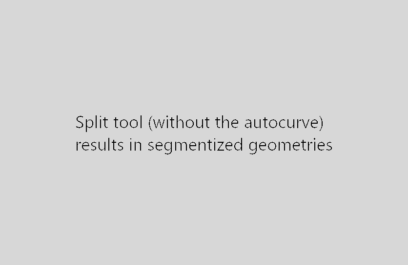

# Autocurve for QGIS

QGIS plugin that adds a toggle that post-processes geometries after edit commands. Currently supports converting to curves and snapping curve midpoints.



This requires QGIS 3.14 or newer.

WARNING : QGIS doesn't support curved geometry operations, which is why by default geometries are segmentized when using features such as split or merge. This means intersections aren't geometrically accurate. The ConvertToCurve just transforms successive points back into curves for easier subsequent editing.

## FAQ

### The plugin does not work / nothing happens / segments are not converted to curves

The most probable cause is that the tolerance to detect curves is too low. This is likely to happen when working on features that are far from the origin (large X or Y coordinates). In such a case, you can try to increase both `Angle tolerance when tracing curves` and `Distance tolerance when tracing curves` settings under `Options>Digitizing>Tracing`. Unfortunately, this requires a bit of trial and error, as there is no one-size-fits-all value for these settings, and, if set too high, other unexpected behaviours can arise (segments mistakenly converted to curve).

## Contribute

Pull requests welcome.

### Code style

Before commiting, please install pre-commit to take care of code style.
```
pip install pre-commit
pre-commit install
```

### Tests

Run the integrations tests with docker
```bash
# Run tests (headless)
docker-compose run tests

# Run tests (with visual feedback)
docker-compose run tests-gui
```

Alternatively, you can also run the `tests_integration.py` script from the Python console in QGIS desktop.
